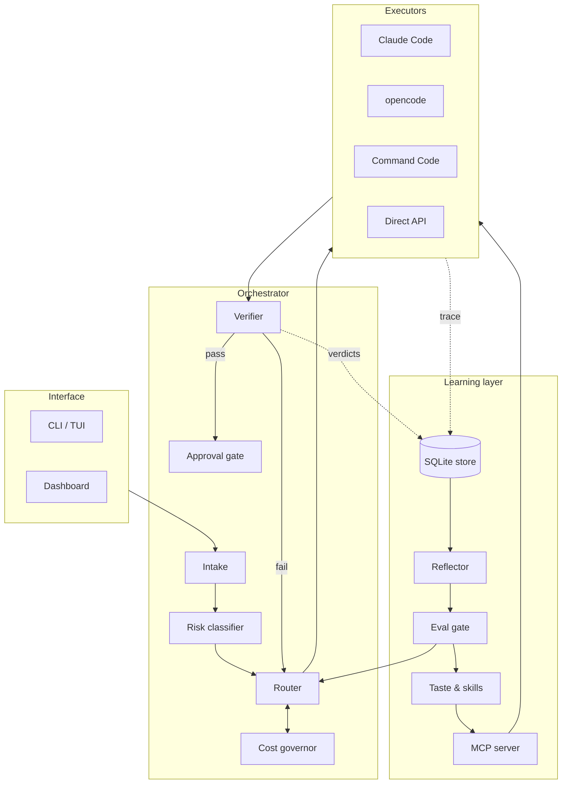
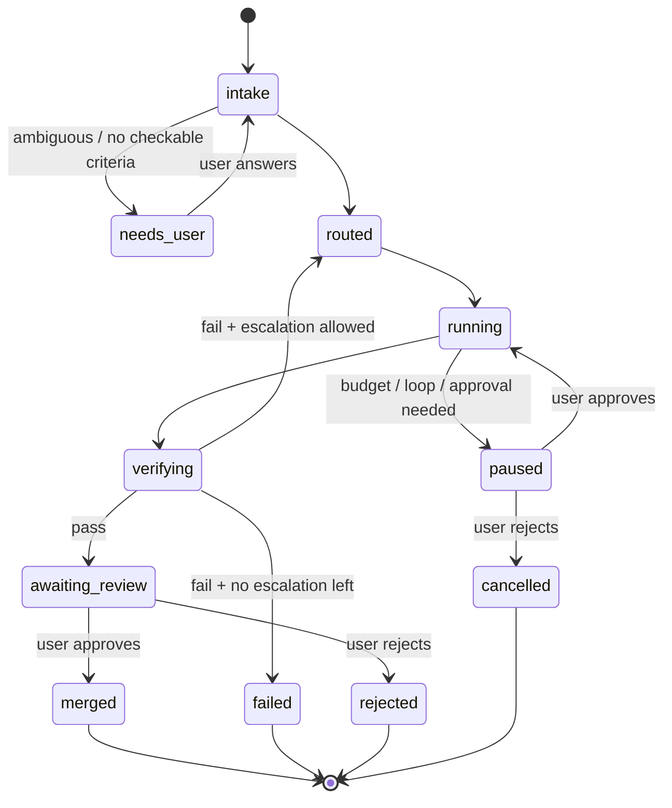

# 03 — Architecture

## Overview

Arpeggio has four layers. Agents are hands; intelligence lives in the orchestrator and the learning layer.



## Task lifecycle



A **task** has one or more **attempts**. Each attempt is one route executed in one worktree. Escalation creates a new attempt; it never mutates an old one.

## Components

| Component | Responsibility | Version |
|---|---|---|
| **Intake** | Normalize the request, derive done criteria, ask clarifying questions, split large tasks. Uses a cheap model. | v1 (split: v2) |
| **Risk classifier** | Compute risk from signals (paths, diff size, irreversible commands, repo privacy class) and combine with a model estimate, taking the max. | v1 |
| **Router** | Choose `(adapter, model, effort, verification_depth)`. Rule-based in v1, contextual bandit in v2. Handles fallback. | v1 / v2 |
| **Cost governor** | Budgets, loop detection, cost recording, counterfactual cost, context diet, cascade gating. | v1 |
| **Quota governor** | Tracks free-tier usage from config and response headers. Decides wait, switch or pause. | v1 |
| **Pricing engine** | Computes cost from tokens, cache hits, and price windows. Schedules deferrable work. | v1 |
| **Provider catalog** | Packaged profile templates with models, prices, limits, `last_verified`. | v1 |
| **Executors (adapters)** | Run an attempt in a worktree through one agent or API; stream steps; report cost. | v1 (2), v2 (4) |
| **Verifier** | Run done criteria; at `full` depth, also run the full suite and a structured model review. | v1 |
| **Approval gate** | Intercept gated actions; queue them; resume or cancel on user decision. | v1 |
| **Store** | SQLite: tasks, attempts, steps, verdicts, feedback, approvals, proposals. | v1 |
| **Reflector** | Classify failures, propose policy/taste/skill/prompt changes. Runs as a batch job. | v2 |
| **Taste & skills** | Vendor-neutral Markdown under `~/.arpeggio/taste/` and `~/.arpeggio/skills/`, exported to each agent's format. | v2 |
| **Eval gate** | Run the eval suite (with holdout) on any proposed change; accept only improvements beyond noise. | v1 (manual), v2 (automatic) |
| **MCP server** | Serve taste, skills, and task context to every agent from one source. | v2 |
| **Dashboard** | Read-only views over the store, plus approval and proposal actions. | v1 (one page), v2 (full) |

## Adapter interface

Every executor implements the same contract. Core code depends only on this protocol.

The code lives in `src/arpeggio_ai/adapters/base.py`. Abridged:

```python
@dataclass(frozen=True)
class Route:
    adapter: str            # "claude_code" | "opencode" | "command_code" | "api"
    model: str              # logical model key from config, e.g. "tier2.flash"
    effort: str             # "low" | "medium" | "high" | "max"
    verification: str       # "light" | "full"

@dataclass(frozen=True)
class AttemptSpec:
    task_id: str
    attempt_id: str
    prompt: str             # first user turn, incl. done criteria
    route: Route
    timeout_s: int          # read timeout and wall-clock deadline of each API request
    max_steps: int          # model calls allowed in this attempt (EXE-06)
    max_tokens: int         # output cap per model call, required
    worktree: str | None = None           # absolute path to the isolated worktree (M0.4)
    context_files: list[str] = []
    system: str | None = None             # optional system message
    follow_ups: list[str] = []            # later user turns, sent after each reply

@dataclass(frozen=True)
class StepEvent:
    kind: str               # "model_call" | "tool_call" | "tool_result" | "message" | "approval_request"
    summary: str            # at most 200 characters, stored on the step
    payload: dict           # stored as an artifact file, never in the database
    input_tokens: int | None = None
    output_tokens: int | None = None
    cached_tokens: int | None = None      # cache-hit input tokens
    cost_usd: float | None = None
    actual_model: str | None = None       # model named in the provider's response (RTE-11)
    cost_estimated: bool = False
    price: PriceSnapshot | None = None    # window, multiplier and prices applied (CST-11)
    model_mismatch: bool = False

@dataclass(frozen=True)
class AttemptResult:
    status: str             # "completed" | "timeout" | "error" | "paused" | "cancelled"
    final_message: str
    changed_files: list[str] = []

class Adapter(Protocol):
    name: str
    def capabilities(self) -> dict[str, bool]: ...   # effort_control, token_reporting, resume, mcp, streaming
    def run(self, spec: AttemptSpec) -> AsyncIterator[StepEvent]: ...
    async def result(self) -> AttemptResult: ...
    async def cancel(self) -> None: ...
    def resume(self, attempt_id: str) -> AsyncIterator[StepEvent]: ...
```

Notes:

- Adapters are created through `adapters/registry.py` from an `AdapterContext` (config, clock, sleep, random source, environment, and an optional HTTP transport for tests). Core code imports `adapters.base` and `adapters.registry` only, never a concrete adapter (EXE-01). Built-in adapters are imported lazily, so commands that make no model call never load httpx.
- Adapters do no disk or database I/O. `orchestrator/attempts.py` (`run_attempt`) consumes the events, writes each payload to `artifacts/`, appends the step with its price snapshot, flags a model mismatch on the attempt, and sets the final status.
- Every adapter passes `tests/contract/test_adapter_contract.py` against a fake backend.
- `capabilities()` lets the router avoid routes an adapter cannot honor (for example, effort control or exact token reporting).
- The `api` adapter (M0.3) speaks non-streaming chat completions to `openai_compatible` providers at `POST {base_url}/chat/completions`. The model's `effort_params` for the chosen effort are merged into the top level of the request body. Before each request the spend guard (`cost/guard.py`) runs. `timeout_s` is both the read timeout and a wall-clock deadline for each request: a response that trickles in and is not complete in time ends the attempt with status `timeout` (EXE-06), and the call is recorded as an estimated step. 429, 500, 502, 503, 504 and timeouts are retried up to 3 times (full-jitter backoff, base 1 s, cap 30 s, `Retry-After` honored up to `max_quota_wait_s`), then the attempt ends with `error` (RTE-12). See [ADR-0007](adr/0007-httpx-and-first-network-calls.md).
- Adapters that wrap CLIs parse the CLI's structured/streaming output. Exact flags must be verified against each tool's current documentation at implementation time.
- Approval-gated actions surface as `approval_request` events; the orchestrator pauses the stream until a decision arrives.

## Worktrees, checks and patch mode (M0.4)

`orchestrator/attempts.py` (`run_patch_attempt`) runs one attempt end to end:

1. A task without done criteria goes to `needs_user`, and no attempt starts (VER-01).
2. The attempt gets its own git worktree at `~/.arpeggio/worktrees/<attempt_id>` on branch `arpeggio/<task_id>/<seq>`, created at the source repo's `HEAD` commit (EXE-04). Uncommitted changes in your working copy are not carried over, and a dirty source logs `worktree.base_dirty`. Your working copy and branches are never modified, and the worktree is kept for inspection after the attempt.
3. In single-shot patch mode ([ADR-0008](adr/0008-single-shot-patch-executor.md), EXE-08), the `api` adapter is asked for exactly one unified diff. The prompt holds the packaged system instruction, the task, each check in plain text, and the requested context files (at most 100 KB, secret file patterns skipped). The task and each context file pass the secret scanner first, and a `prompt` step records how many items were redacted ([Secrets](07-SECURITY-AND-PRIVACY.md#secrets)).
4. The diff is validated, its line endings are matched to each file (CRLF, LF, or left alone for a mixed file), and it is applied with `git apply` and committed on the attempt branch as `Arpeggio <arpeggio@localhost>`. The model's diff is stored as `patch-raw.diff` and the applied one as `patch.diff`, behind a `patch` step. A missing, ambiguous, unsafe or non-applying diff ends the attempt with status `error` and `failure_reason`, and the task fails.
5. Every criterion runs in the worktree, in stored order, even after a failure. All pass: the task moves to `awaiting_review`. Any failure: the task is `failed`, since escalation (VER-03) is not built yet.

Checks and git commands run through `safety/process.py`. The environment starts from an allowlist plus `[repo] check_env`, and provider key variables are always removed (SAF-02). Each check has a timeout, and on expiry the whole process tree is killed: the process group on POSIX, the check's Job Object on Windows, with `taskkill /T /F` as the fallback when Windows refuses a job (EXE-06). Every git command runs with hooks disabled, `core.autocrlf=false` and commit signing off.

## Gateways and local providers

Gateways (OpenRouter, 9Router, LiteLLM) and local servers (Ollama) are configured as `openai_compatible` providers. Local ones may use plain `http` on a loopback address and need no API key. Arpeggio never relies on gateway-side fallback for learning data: each step records the model that actually answered, and a mismatch keeps the attempt out of router learning (RTE-11). Configure gateways with fallback disabled or a fixed model. See [ADR-0006](adr/0006-gateways-and-free-tier-ethics.md) and [Gateways and free tiers](05-ROUTING-AND-COST.md#gateways-and-free-tiers).

## Technology stack

| Concern | Choice | Reason |
|---|---|---|
| Language | Python 3.12 | Owner's main language; strong ML and data ecosystem. |
| Packaging | `uv` | Fast, reproducible. |
| CLI | Typer + Rich | Simple commands, good streaming output. |
| TUI (v2) | Textual | Same ecosystem as Rich. |
| Config | TOML + Pydantic | Typed validation with clear errors. |
| Storage | SQLite (WAL mode) via `sqlite3` + thin repository layer | Zero ops, fast enough, single file backup. |
| Migrations | Plain numbered SQL files | Small schema; avoids ORM lock-in. |
| HTTP to providers | `httpx` (OpenAI-compatible and native APIs) | Async, streaming. |
| Concurrency | `asyncio` | Parallel attempts and streaming. |
| Isolation | `git worktree`; optional Docker/Podman | Cheap isolation by default, strong isolation when needed. |
| Dashboard | FastAPI + server-rendered HTML (HTMX) + a chart library | Minimal frontend; no build step in v1. |
| MCP (v2) | Official MCP Python SDK | Standard way to share context with agents. |
| Testing | pytest, pytest-asyncio, hypothesis for policy logic | |
| Quality | ruff (lint and format), mypy `--strict` on all of `src/arpeggio_ai` | |

## Repository layout

```
arpeggio/
├── AGENTS.md
├── CLAUDE.md
├── README.md
├── pyproject.toml
├── uv.lock
├── docs/
│   ├── 01-VISION-AND-GOALS.md … 08-ROADMAP.md
│   └── adr/
├── config/
│   └── policy.example.yaml        # routing policy (rules), planned
├── src/arpeggio_ai/
│   ├── paths.py                   # ARPEGGIO_HOME and config file locations
│   ├── config/                    # models.py (Pydantic schema), loader.py (read, merge, validate)
│   │   └── templates/
│   │       ├── free.toml               # one template per budget profile, written by
│   │       ├── micro-deepseek.toml     #   `arpeggio init --profile <name>`
│   │       ├── standard.toml
│   │       └── pro.toml
│   ├── cli/                       # Typer app, output helpers, commands/
│   ├── core/                      # errors.py, ids.py (ULID), clock.py (UTC timestamps), logs.py (JSON lines),
│   │                              #   later task, attempt, lifecycle state machine, orchestrator
│   ├── intake/                    # criteria derivation, clarification, splitting
│   ├── routing/                   # risk.py, policy.py, bandit.py (v2), fallback.py
│   ├── cost/                      # pricing.py, guard.py; later governor.py, budget.py, loops.py, context_diet.py
│   ├── adapters/                  # base.py, registry.py, api.py; later claude_code.py, opencode.py, command_code.py
│   ├── orchestrator/              # attempts.py (run an attempt, record steps), patch.py (patch mode), prompts/
│   ├── verify/                    # criteria.py, runner.py; later reviewer.py, depth.py
│   ├── safety/                    # process.py (checks: env, timeout, tree kill), worktree.py; later approvals.py, sandbox.py
│   ├── store/                     # db.py (connection, migrations), repositories.py, artifacts.py,
│   │                              #   migrations/0001_initial.sql
│   ├── learning/                  # reflector.py, taste.py, skills.py, export.py (v2)
│   ├── evals/                     # loader, runner, strategies, report
│   ├── mcp/                       # MCP server (v2)
│   └── dashboard/                 # FastAPI app, templates
├── evals/
│   ├── tasks/                     # tuning set
│   └── holdout/                   # never used for tuning
└── tests/
    ├── unit/
    ├── contract/                  # adapter contract tests
    └── integration/
```

The profile templates (`free.toml`, `micro-deepseek.toml`, `standard.toml`, `pro.toml`) live in `src/arpeggio_ai/config/templates/`, inside the package, so an installed `arpeggio init` can read them through `importlib.resources`.

## Data and file locations

| Path | Contents |
|---|---|
| `~/.arpeggio/arpeggio.db` | SQLite store |
| `~/.arpeggio/config.toml` | Global config (no secrets) |
| `~/.arpeggio/artifacts/<task>/<attempt>/` | Full tool outputs, logs, diffs too large for the DB |
| `~/.arpeggio/worktrees/<attempt>/` | Isolated worktrees (cleaned after merge/reject) |
| `~/.arpeggio/taste/` | Vendor-neutral taste rules (git repo) |
| `~/.arpeggio/skills/` | Reusable skills (git repo) |
| `~/.arpeggio/logs/YYYY-MM-DD.jsonl` | Structured logs, one JSON object per line and one file per UTC day (OBS-03) |
| `~/.arpeggio/backups/` | Database copies taken before each schema migration, five newest kept |
| `<repo>/.arpeggio/config.toml` | Per-repo overrides, deep-merged over the global config. The only file allowed a `[repo]` table (privacy class, provider allowlist). Checks are planned. |

`~/.arpeggio` is the default home. Set `ARPEGGIO_HOME` to use another directory. `arpeggio init` creates the home and its `artifacts/`, `worktrees/`, `taste/`, `skills/`, `logs/` and `backups/` subdirectories with mode `0700` on POSIX, then creates or migrates `arpeggio.db`.

## Key design decisions

See [ADRs](adr/). Summary:

1. Orchestrate existing agents instead of building an agent loop ([ADR-0001](adr/0001-orchestrate-existing-agents.md)).
2. Python + SQLite, local-first ([ADR-0002](adr/0002-python-sqlite-local-first.md)).
3. Rule-based router before learned router ([ADR-0003](adr/0003-rule-based-router-first.md)).
4. Learning produces proposals, never direct changes ([ADR-0004](adr/0004-learning-via-proposals.md)).
5. Budget profiles: the same pipeline at every budget ([ADR-0005](adr/0005-budget-profiles.md)).
6. Gateways are plain providers, with provenance and privacy rules ([ADR-0006](adr/0006-gateways-and-free-tier-ethics.md)).
7. httpx for provider calls, a spend guard before every request, no network in tests ([ADR-0007](adr/0007-httpx-and-first-network-calls.md)).
