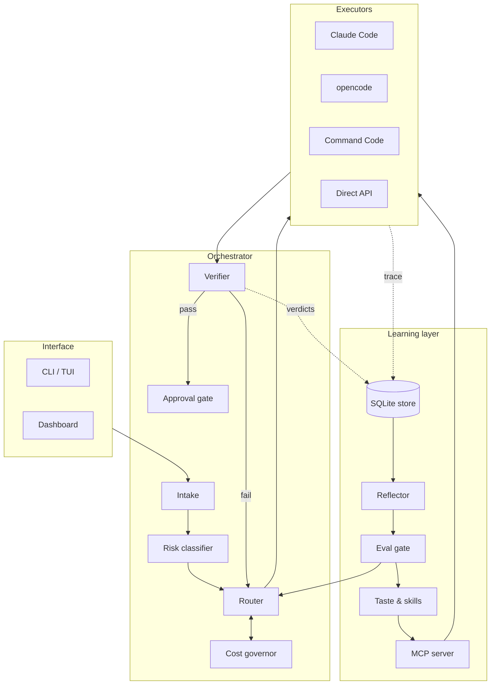
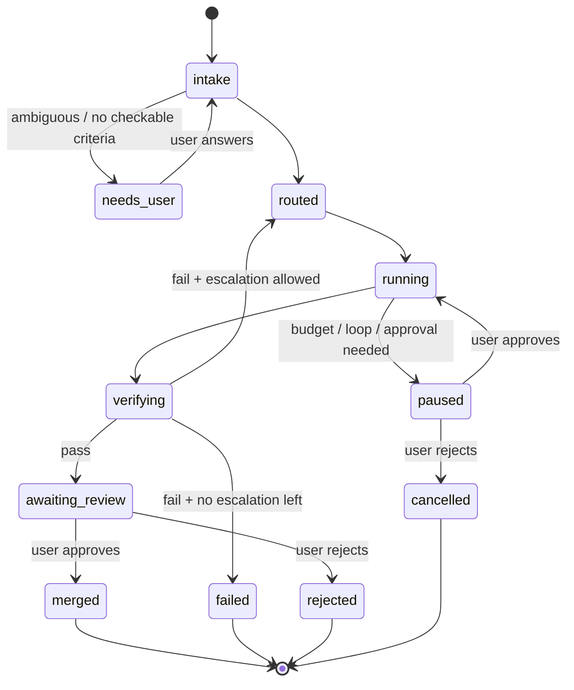

# 03 — Architecture

## Overview

Arpeggio has four layers. Agents are hands; intelligence lives in the orchestrator and the learning layer.



## Task lifecycle



A **task** has one or more **attempts**. Each attempt is one route executed in one worktree. Escalation creates a new attempt; it never mutates an old one.

## Components

| Component | Responsibility | Version |
|---|---|---|
| **Intake** | Normalize the request, derive done criteria, ask clarifying questions, split large tasks. Uses a cheap model. | v1 (split: v2) |
| **Risk classifier** | Compute risk from signals (paths, diff size, irreversible commands, repo privacy class) and combine with a model estimate, taking the max. | v1 |
| **Router** | Choose `(adapter, model, effort, verification_depth)`. Rule-based in v1, contextual bandit in v2. Handles fallback. | v1 / v2 |
| **Cost governor** | Budgets, loop detection, cost recording, counterfactual cost, context diet, cascade gating. | v1 |
| **Executors (adapters)** | Run an attempt in a worktree through one agent or API; stream steps; report cost. | v1 (2), v2 (4) |
| **Verifier** | Run done criteria; at `full` depth, also run the full suite and a structured model review. | v1 |
| **Approval gate** | Intercept gated actions; queue them; resume or cancel on user decision. | v1 |
| **Store** | SQLite: tasks, attempts, steps, verdicts, feedback, approvals, proposals. | v1 |
| **Reflector** | Classify failures, propose policy/taste/skill/prompt changes. Runs as a batch job. | v2 |
| **Taste & skills** | Vendor-neutral Markdown under `~/.arpeggio/taste/` and `~/.arpeggio/skills/`, exported to each agent's format. | v2 |
| **Eval gate** | Run the eval suite (with holdout) on any proposed change; accept only improvements beyond noise. | v1 (manual), v2 (automatic) |
| **MCP server** | Serve taste, skills, and task context to every agent from one source. | v2 |
| **Dashboard** | Read-only views over the store, plus approval and proposal actions. | v1 (one page), v2 (full) |

## Adapter interface

Every executor implements the same contract. Core code depends only on this protocol.

```python
from typing import Protocol, AsyncIterator
from dataclasses import dataclass

@dataclass(frozen=True)
class Route:
    adapter: str            # "claude_code" | "opencode" | "command_code" | "api"
    model: str              # logical model id from config, e.g. "tier2.sonnet"
    effort: str             # "low" | "medium" | "high" | "max"
    verification: str       # "light" | "full"

@dataclass
class AttemptSpec:
    task_id: str
    attempt_id: str
    prompt: str             # final prompt incl. done criteria
    worktree: str           # absolute path to isolated worktree
    route: Route
    timeout_s: int
    max_steps: int
    context_files: list[str]

@dataclass
class StepEvent:
    kind: str               # "model_call" | "tool_call" | "tool_result" | "message" | "approval_request"
    payload: dict
    input_tokens: int | None
    output_tokens: int | None
    cached_tokens: int | None
    cost_usd: float | None
    cost_estimated: bool

@dataclass
class AttemptResult:
    status: str             # "completed" | "timeout" | "error" | "paused"
    final_message: str
    changed_files: list[str]

class Adapter(Protocol):
    name: str
    def capabilities(self) -> dict: ...          # effort control, token reporting, resume, mcp
    async def run(self, spec: AttemptSpec) -> AsyncIterator[StepEvent]: ...
    async def result(self) -> AttemptResult: ...
    async def cancel(self) -> None: ...
    async def resume(self, attempt_id: str) -> AsyncIterator[StepEvent]: ...
```

Notes:

- `capabilities()` lets the router avoid routes an adapter cannot honor (for example, effort control or exact token reporting).
- Adapters that wrap CLIs parse the CLI's structured/streaming output. Exact flags must be verified against each tool's current documentation at implementation time.
- Approval-gated actions surface as `approval_request` events; the orchestrator pauses the stream until a decision arrives.

## Technology stack

| Concern | Choice | Reason |
|---|---|---|
| Language | Python 3.12 | Owner's main language; strong ML and data ecosystem. |
| Packaging | `uv` | Fast, reproducible. |
| CLI | Typer + Rich | Simple commands, good streaming output. |
| TUI (v2) | Textual | Same ecosystem as Rich. |
| Config | TOML + Pydantic | Typed validation with clear errors. |
| Storage | SQLite (WAL mode) via `sqlite3` + thin repository layer | Zero ops, fast enough, single file backup. |
| Migrations | Plain numbered SQL files | Small schema; avoids ORM lock-in. |
| HTTP to providers | `httpx` (OpenAI-compatible and native APIs) | Async, streaming. |
| Concurrency | `asyncio` | Parallel attempts and streaming. |
| Isolation | `git worktree`; optional Docker/Podman | Cheap isolation by default, strong isolation when needed. |
| Dashboard | FastAPI + server-rendered HTML (HTMX) + a chart library | Minimal frontend; no build step in v1. |
| MCP (v2) | Official MCP Python SDK | Standard way to share context with agents. |
| Testing | pytest, pytest-asyncio, hypothesis for policy logic | |
| Quality | ruff (lint and format), mypy `--strict` on all of `src/arpeggio_ai` | |

## Repository layout

```
arpeggio/
├── AGENTS.md
├── CLAUDE.md
├── README.md
├── pyproject.toml
├── uv.lock
├── docs/
│   ├── 01-VISION-AND-GOALS.md … 08-ROADMAP.md
│   └── adr/
├── config/
│   └── policy.example.yaml        # routing policy (rules), planned
├── src/arpeggio_ai/
│   ├── paths.py                   # ARPEGGIO_HOME and config file locations
│   ├── config/                    # models.py (Pydantic schema), loader.py (read, merge, validate)
│   │   └── templates/
│   │       └── config.example.toml    # providers, tiers, prices, budgets (written by `arpeggio init`)
│   ├── cli/                       # Typer app, output helpers, commands/
│   ├── core/                      # errors.py now, later task, attempt, lifecycle state machine, orchestrator
│   ├── intake/                    # criteria derivation, clarification, splitting
│   ├── routing/                   # risk.py, policy.py, bandit.py (v2), fallback.py
│   ├── cost/                      # governor.py, pricing.py, budget.py, loops.py, context_diet.py
│   ├── adapters/                  # base.py, registry.py, claude_code.py, api.py, opencode.py, command_code.py
│   ├── verify/                    # runner.py, reviewer.py, depth.py
│   ├── safety/                    # approvals.py, secrets.py, worktree.py, sandbox.py
│   ├── store/                     # db.py, repositories, migrations/*.sql
│   ├── learning/                  # reflector.py, taste.py, skills.py, export.py (v2)
│   ├── evals/                     # loader, runner, strategies, report
│   ├── mcp/                       # MCP server (v2)
│   └── dashboard/                 # FastAPI app, templates
├── evals/
│   ├── tasks/                     # tuning set
│   └── holdout/                   # never used for tuning
└── tests/
    ├── unit/
    ├── contract/                  # adapter contract tests
    └── integration/
```

The example config lives at `src/arpeggio_ai/config/templates/config.example.toml`, inside the package, so an installed `arpeggio init` can read it through `importlib.resources`.

## Data and file locations

| Path | Contents |
|---|---|
| `~/.arpeggio/arpeggio.db` | SQLite store |
| `~/.arpeggio/config.toml` | Global config (no secrets) |
| `~/.arpeggio/artifacts/<task>/<attempt>/` | Full tool outputs, logs, diffs too large for the DB |
| `~/.arpeggio/worktrees/<attempt>/` | Isolated worktrees (cleaned after merge/reject) |
| `~/.arpeggio/taste/` | Vendor-neutral taste rules (git repo) |
| `~/.arpeggio/skills/` | Reusable skills (git repo) |
| `~/.arpeggio/logs/` | Structured JSON logs (OBS-03) |
| `<repo>/.arpeggio/config.toml` | Per-repo overrides, deep-merged over the global config. The only file allowed a `[repo]` table (privacy class, provider allowlist). Checks are planned. |

`~/.arpeggio` is the default home. Set `ARPEGGIO_HOME` to use another directory. `arpeggio init` creates the home and its `artifacts/`, `worktrees/`, `taste/`, `skills/` and `logs/` subdirectories with mode `0700` on POSIX.

## Key design decisions

See [ADRs](adr/). Summary:

1. Orchestrate existing agents instead of building an agent loop ([ADR-0001](adr/0001-orchestrate-existing-agents.md)).
2. Python + SQLite, local-first ([ADR-0002](adr/0002-python-sqlite-local-first.md)).
3. Rule-based router before learned router ([ADR-0003](adr/0003-rule-based-router-first.md)).
4. Learning produces proposals, never direct changes ([ADR-0004](adr/0004-learning-via-proposals.md)).
