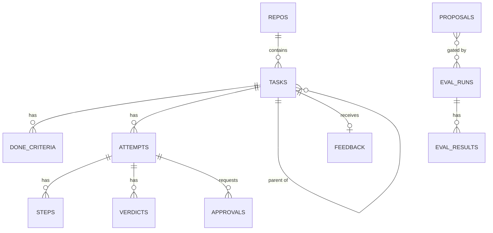

# 04 — Data Model

Everything Arpeggio knows lives in one SQLite database (`~/.arpeggio/arpeggio.db`, WAL mode). Every feature — routing, learning, dashboard, evals — is a different read over the same tables. Get this schema right before writing feature code.

## Entity overview



## Conventions

- IDs are ULIDs stored as `TEXT` (sortable by time, safe to generate offline).
- Timestamps are ISO-8601 UTC `TEXT` in the fixed-width form `YYYY-MM-DDTHH:MM:SS.mmmZ`, so text order equals time order. SQLite's `datetime('now')` uses a space instead of `T`, so views must compare against `strftime('%Y-%m-%dT%H:%M:%fZ', ...)`.
- Money is `REAL` in USD with prices snapshotted at call time; never recompute historical cost from current prices.
- JSON columns are `TEXT` validated by the application.
- Large blobs (full tool outputs, diffs, logs) go to `~/.arpeggio/artifacts/`; the DB stores a relative path.
- Rows are append-mostly. Status changes update a row; history of decisions is never deleted.

## Schema

The cumulative schema after every migration (currently `0001` and `0002`, see [Migration history](#migration-history)). Columns added by a later migration sit at the end of their table, in the order the migration adds them. A test builds this block in memory and compares it, column by column, with a database that ran all migrations.

```sql
PRAGMA journal_mode = WAL;
PRAGMA foreign_keys = ON;

CREATE TABLE repos (
    id              TEXT PRIMARY KEY,
    path            TEXT NOT NULL UNIQUE,
    name            TEXT NOT NULL,
    privacy_class   TEXT NOT NULL DEFAULT 'private'
                    CHECK (privacy_class IN ('public','private','client')),
    provider_allow  TEXT,                      -- JSON array; NULL = all configured providers
    created_at      TEXT NOT NULL
);

CREATE TABLE tasks (
    id                  TEXT PRIMARY KEY,
    repo_id             TEXT NOT NULL REFERENCES repos(id),
    parent_id           TEXT REFERENCES tasks(id),
    title               TEXT NOT NULL,
    request             TEXT NOT NULL,          -- original user text
    spec                TEXT,                   -- clarified spec after intake
    category            TEXT,                   -- e.g. 'refactor','feature','bugfix','docs','data_pipeline','ml_experiment'
    risk                TEXT CHECK (risk IN ('low','medium','high')),
    risk_signals        TEXT,                   -- JSON: which signals fired and their weights
    status              TEXT NOT NULL,          -- see lifecycle in 03-ARCHITECTURE
    source              TEXT NOT NULL DEFAULT 'user'
                        CHECK (source IN ('user','eval','shadow')),
    budget_usd          REAL,
    counterfactual_usd  REAL,                   -- estimated cost on default frontier route
    created_at          TEXT NOT NULL,
    finished_at         TEXT,
    profile             TEXT NOT NULL DEFAULT 'unknown',  -- free|micro|standard|pro, or 'unknown' before 0002
    "deferrable"        INTEGER NOT NULL DEFAULT 0       -- quoted: DEFERRABLE is an SQLite keyword (CST-10)
);
CREATE INDEX idx_tasks_status   ON tasks(status);
CREATE INDEX idx_tasks_category ON tasks(category, risk);

CREATE TABLE done_criteria (
    id          TEXT PRIMARY KEY,
    task_id     TEXT NOT NULL REFERENCES tasks(id),
    kind        TEXT NOT NULL CHECK (kind IN ('command','file_exists','metric','review')),
    spec        TEXT NOT NULL,                  -- JSON, e.g. {"cmd":"pytest tests/x.py","expect_exit":0}
    origin      TEXT NOT NULL CHECK (origin IN ('user','derived'))
);

CREATE TABLE attempts (
    id              TEXT PRIMARY KEY,
    task_id         TEXT NOT NULL REFERENCES tasks(id),
    seq             INTEGER NOT NULL,           -- 1, 2, 3… within the task
    adapter         TEXT NOT NULL,
    model           TEXT NOT NULL,              -- logical id from config
    provider_model  TEXT,                       -- concrete provider model string actually used
    effort          TEXT NOT NULL,
    verification    TEXT NOT NULL CHECK (verification IN ('light','full')),
    route_reason    TEXT NOT NULL,              -- JSON: policy rule id or bandit sample
    mode            TEXT NOT NULL DEFAULT 'normal'
                    CHECK (mode IN ('normal','explore','shadow','tournament')),
    worktree        TEXT,
    branch          TEXT,
    status          TEXT NOT NULL,              -- running|completed|timeout|error|paused|cancelled
    cost_usd        REAL NOT NULL DEFAULT 0,
    cost_estimated  INTEGER NOT NULL DEFAULT 0,
    input_tokens    INTEGER NOT NULL DEFAULT 0,
    output_tokens   INTEGER NOT NULL DEFAULT 0,
    cached_tokens   INTEGER NOT NULL DEFAULT 0,  -- cache-hit input tokens
    steps_count     INTEGER NOT NULL DEFAULT 0,
    started_at      TEXT NOT NULL,
    finished_at     TEXT,
    checkpoint      TEXT,                       -- JSON for resume
    model_mismatch  INTEGER NOT NULL DEFAULT 0, -- served model differed from requested (RTE-11)
    deferred_until  TEXT,                       -- start no earlier than this (CST-10)
    UNIQUE (task_id, seq)
);
CREATE INDEX idx_attempts_route ON attempts(adapter, model, effort);

CREATE TABLE steps (
    id              TEXT PRIMARY KEY,
    attempt_id      TEXT NOT NULL REFERENCES attempts(id),
    seq             INTEGER NOT NULL,
    kind            TEXT NOT NULL,              -- model_call|tool_call|tool_result|message|approval_request
    summary         TEXT,                       -- short human-readable line
    payload_ref     TEXT,                       -- path in artifacts/ for full content
    input_tokens    INTEGER,
    output_tokens   INTEGER,
    cached_tokens   INTEGER,                    -- cache-hit input tokens
    price_in_per_m  REAL,                       -- USD per 1M input tokens at call time
    price_out_per_m REAL,
    cost_usd        REAL,
    cost_estimated  INTEGER NOT NULL DEFAULT 0,
    created_at      TEXT NOT NULL,
    actual_model          TEXT,                 -- model named in the provider response
    price_window          TEXT,                 -- 'peak' | 'offpeak' | 'flat'
    price_multiplier      REAL NOT NULL DEFAULT 1.0,
    price_cache_hit_per_m REAL,                 -- USD per 1M cache-hit input tokens at call time
    UNIQUE (attempt_id, seq)
);

CREATE TABLE verdicts (
    id              TEXT PRIMARY KEY,
    attempt_id      TEXT NOT NULL REFERENCES attempts(id),
    criterion_id    TEXT REFERENCES done_criteria(id),
    kind            TEXT NOT NULL CHECK (kind IN ('check','full_suite','model_review','user_review')),
    passed          INTEGER NOT NULL,
    detail          TEXT,                       -- JSON: exit code, failing tests, review issues
    log_ref         TEXT,
    cost_usd        REAL NOT NULL DEFAULT 0,    -- verification cost counts toward the task
    created_at      TEXT NOT NULL
);

CREATE TABLE approvals (
    id              TEXT PRIMARY KEY,
    attempt_id      TEXT REFERENCES attempts(id),
    task_id         TEXT NOT NULL REFERENCES tasks(id),
    action          TEXT NOT NULL,              -- merge|force_push|delete_outside_worktree|migration|deploy|budget_extend|...
    detail          TEXT NOT NULL,              -- JSON: exact command or diff summary
    decision        TEXT CHECK (decision IN ('approved','rejected')),
    decided_by      TEXT,                       -- 'user' (future: other actors)
    requested_at    TEXT NOT NULL,
    decided_at      TEXT
);

CREATE TABLE feedback (
    task_id             TEXT PRIMARY KEY REFERENCES tasks(id),
    accepted_attempt_id TEXT REFERENCES attempts(id),
    post_agent_diff_ref TEXT,                   -- diff between agent output and what was merged
    post_agent_lines    INTEGER,                -- changed lines by user after agent
    interventions       INTEGER NOT NULL DEFAULT 0,
    user_rating         INTEGER CHECK (user_rating BETWEEN 1 AND 5),
    note                TEXT,
    escaped             INTEGER NOT NULL DEFAULT 0,  -- set later if a revert/fix links back
    escape_ref          TEXT,                   -- commit or issue that revealed the problem
    failure_class       TEXT,                   -- reflector output for failed tasks (v2)
    created_at          TEXT NOT NULL
);

CREATE TABLE proposals (
    id              TEXT PRIMARY KEY,
    kind            TEXT NOT NULL CHECK (kind IN ('policy','taste','skill','prompt')),
    title           TEXT NOT NULL,
    rationale       TEXT NOT NULL,              -- which tasks/failures motivated it
    patch_ref       TEXT NOT NULL,              -- path to a git patch
    status          TEXT NOT NULL DEFAULT 'pending'
                    CHECK (status IN ('pending','gating','accepted','rejected')),
    eval_run_id     TEXT REFERENCES eval_runs(id),
    created_at      TEXT NOT NULL,
    decided_at      TEXT
);

CREATE TABLE eval_runs (
    id              TEXT PRIMARY KEY,
    strategy        TEXT NOT NULL,              -- junior|middle|senior|arpeggio|<proposal id>
    split           TEXT NOT NULL CHECK (split IN ('tuning','holdout','all')),
    git_sha         TEXT NOT NULL,              -- harness version under test
    config_hash     TEXT NOT NULL,
    started_at      TEXT NOT NULL,
    finished_at     TEXT,
    summary         TEXT,                       -- JSON: metrics with confidence intervals
    profile         TEXT NOT NULL DEFAULT 'unknown'
);

CREATE TABLE eval_results (
    eval_run_id     TEXT NOT NULL REFERENCES eval_runs(id),
    eval_task       TEXT NOT NULL,              -- eval task file id
    task_id         TEXT NOT NULL REFERENCES tasks(id),
    solved          INTEGER NOT NULL,
    cost_usd        REAL NOT NULL,
    attempts        INTEGER NOT NULL,
    duration_s      REAL NOT NULL,
    quota_wait_s    REAL NOT NULL DEFAULT 0,  -- time spent waiting on quotas
    PRIMARY KEY (eval_run_id, eval_task)
);

CREATE TABLE quota_usage (
    provider        TEXT    NOT NULL,
    model           TEXT    NOT NULL,
    window          TEXT    NOT NULL,          -- 'minute' | 'day'
    window_start    TEXT    NOT NULL,
    requests        INTEGER NOT NULL DEFAULT 0,
    input_tokens    INTEGER NOT NULL DEFAULT 0,
    output_tokens   INTEGER NOT NULL DEFAULT 0,
    remaining_req   INTEGER,                   -- from headers when available
    remaining_tok   INTEGER,
    reset_at        TEXT,
    source          TEXT    NOT NULL,          -- 'config' | 'header'
    PRIMARY KEY (provider, model, window, window_start)
);

CREATE TABLE schema_version (
    version     INTEGER PRIMARY KEY,
    applied_at  TEXT NOT NULL
);
```

## Implementation notes

- The schema above ships as `src/arpeggio_ai/store/migrations/0001_initial.sql`, minus the two PRAGMAs. `store/db.py` sets those on every connection: `foreign_keys` only lasts for one connection, and `journal_mode` cannot change inside a transaction.
- `open_db` applies pending migrations in order, each in its own `BEGIN IMMEDIATE` transaction, and refuses a database whose `schema_version` is newer than the code. A schema change means a new numbered file there plus an update to this document.
- Before migrating a database that already has a schema, `open_db` copies it to `~/.arpeggio/backups/arpeggio.db.pre-v<target>.<YYYYMMDDTHHMMSSZ>` with SQLite's online backup API, which is safe while WAL is in use. If the backup fails, nothing is migrated. Only the five newest backups are kept, and only files with exactly that name pattern are ever deleted. A brand-new database is not backed up.
- Status and enum-like columns have no SQL `CHECK`, including the ones added in `0002` (`tasks.profile`, `steps.price_window`, `quota_usage.window`, `quota_usage.source`). The repository layer (`store/repositories.py`) checks them against Python `Literal` types, because changing a `CHECK` in SQLite means rebuilding the table. Repositories write only the four real profiles (`free`, `micro`, `standard`, `pro`) and read `unknown` as well.
- The token and cost totals on `attempts` are the one exception to the rule below. Each step updates them in the same transaction that inserts the step, because live cost is needed while the attempt runs (CLI-02, CST-03). A test keeps them equal to `SUM` over `steps`.
- Repositories exist for `repos`, `tasks`, `attempts` and `steps`. The other tables, `quota_usage` included (first used in M1.11), get theirs in the milestone that first writes them.
- `cached_tokens` counts cache-hit input tokens, which are priced at `price_cache_hit_per_m`.
- The views below are not created yet. They arrive as a migration together with the first feature that reads them (baseline report in M0.6, dashboard in M1.9).

## Derived metrics (as SQL views)

Metrics are computed from data, never stored as mutable counters.

```sql
-- Cost per solved task, user tasks only, last 30 days
CREATE VIEW v_cost_per_solved_30d AS
SELECT
    t.category,
    COUNT(*) FILTER (WHERE t.status = 'merged')                    AS solved,
    SUM(a.cost_usd) + COALESCE(SUM(v.cost_usd), 0)                 AS total_cost,
    (SUM(a.cost_usd) + COALESCE(SUM(v.cost_usd), 0))
        / NULLIF(COUNT(DISTINCT t.id) FILTER (WHERE t.status = 'merged'), 0) AS cost_per_solved
FROM tasks t
JOIN attempts a       ON a.task_id = t.id
LEFT JOIN verdicts v  ON v.attempt_id = a.id
WHERE t.source = 'user'
  AND t.created_at >= datetime('now', '-30 days')
GROUP BY t.category;
```

> Note: the join above double-counts when an attempt has several verdicts. The real implementation must aggregate attempts and verdicts in separate subqueries before joining. This is a known trap; cover it with a test.

Other views to implement: `v_success_rate`, `v_escape_rate`, `v_route_stats` (per category × route: n, successes, mean cost — the bandit's input), `v_daily_spend`, `v_counterfactual_savings`, `v_quota_remaining`, `v_value_per_profile`.

## Migration history

| File | Milestone | Change |
|---|---|---|
| `0001_initial.sql` | M0.2 | The v1 tables and indexes. |
| `0002_budget_profiles.sql` | M0.2.5 | `tasks.profile` and `tasks.deferrable`, `attempts.model_mismatch` and `attempts.deferred_until`, `steps.actual_model`, `steps.price_window`, `steps.price_multiplier` and `steps.price_cache_hit_per_m`, `eval_runs.profile`, `eval_results.quota_wait_s`, and the new `quota_usage` table. Existing rows get the defaults, so tasks and eval runs created before `0002` read `profile = 'unknown'`. |

## Retention

- DB rows: kept forever (they are the learning data).
- Artifacts: full payloads older than 90 days MAY be compressed; never deleted for tasks referenced by eval runs or proposals.
- Worktrees: removed after merge, reject, or cancel.
